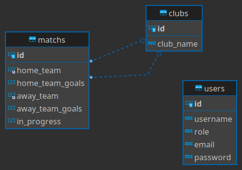

### Termos e acordos

Ao iniciar este projeto, você concorda com as diretrizes do Código de Ética e Conduta e do Manual da Pessoa Estudante da Trybe.

---

# Boas vindas ao repositório do TFC - Trybe Futebol Clube! ⚽️

Você já usa o GitHub diariamente para desenvolver os exercícios, certo? Agora, para desenvolver os projetos, você deverá seguir as instruções a seguir. Fique atento a cada passo, e se tiver qualquer dúvida, nos envie por Slack! #vqv 🚀

Aqui você vai encontrar os detalhes de como estruturar o desenvolvimento do seu projeto a partir deste repositório, utilizando uma branch específica e um Pull Request para colocar seus códigos.

---

# Sumário

- [Boas vindas ao repositório do TFC - Trybe Futebol Clube! ⚽️](#boas-vindas-ao-repositório-do-tfc---trybe-futebol-clube-️)
- [Habilidades](#habilidades)
- [Entregáveis](#entregáveis)
  - [O que deverá ser desenvolvido](#o-que-deverá-ser-desenvolvido)
  - [Desenvolvimento](#desenvolvimento)
    - [Data de Entrega](#data-de-entrega)
- [Instruções para entregar seu projeto:](#instruções-para-entregar-seu-projeto)
    - [Antes de começar a desenvolver](#antes-de-começar-a-desenvolver)
    - [Durante o desenvolvimento](#durante-o-desenvolvimento)
- [Como desenvolver](#como-desenvolver)
  - [Linter](#linter)
- [Requisitos do projeto:](#requisitos-do-projeto)
  - [Antes de começar:](#antes-de-começar)
    - [⚠️ Leia-os atentamente e siga à risca o que for pedido. ⚠️](#️-leia-os-atentamente-e-siga-à-risca-o-que-for-pedido-️)
    - [👀 Observações importantes:](#-observações-importantes)
      - [⚠️ **Inicie seu `docker-compose` antes de testar localmente!** ⚠️](#️-inicie-seu-docker-compose-antes-de-testar-localmente-️)
      - [Variáveis de ambiente](#variáveis-de-ambiente)
      - [Variáveis:](#variáveis)
      - [Chave JWT:](#chave-jwt)
      - [Testes de cobertura](#testes-de-cobertura)
    - [Dicas](#dicas)
      - [Status HTTP](#status-http)
  - [Lista Pré-Requisitos:](#lista-pré-requisitos)
    - [Docker e Docker-compose](#docker-e-docker-compose)
      - [Crie os arquivos dockerfile e docker-compose](#crie-os-arquivos-dockerfile-e-docker-compose)
  - [Lista de Requisitos:](#lista-de-requisitos)
    - [Sequelize](#sequelize)
      - [1 - Desenvolva em /app/backend/src/database nas pastas correspondentes, uma migration e um model para a tabela de clubs](#1---desenvolva-em-appbackendsrcdatabase-nas-pastas-correspondentes-uma-migration-e-um-model-para-a-tabela-de-clubs)
      - [2 - Desenvolva em /app/backend/src/database nas pastas correspondentes, uma migration e um model para a tabela de matchs](#2---desenvolva-em-appbackendsrcdatabase-nas-pastas-correspondentes-uma-migration-e-um-model-para-a-tabela-de-matchs)
      - [3 - Desenvolva em /app/backend/src/database nas pastas correspondentes, uma migration e um model para a tabela de users](#3---desenvolva-em-appbackendsrcdatabase-nas-pastas-correspondentes-uma-migration-e-um-model-para-a-tabela-de-users)
    - [Login](#login)
      - [4 - (`TDD`) Desenvolva testes que cubram no mínimo 5 por cento dos arquivo backend em /src com um mínimo de 7 linhas cobertas](#4---tdd-desenvolva-testes-que-cubram-no-mínimo-5-por-cento-dos-arquivo-backend-em-src-com-um-mínimo-de-7-linhas-cobertas)
      - [5 - Desenvolva o endpoint /login no backend de maneira ele permita o acesso com dados válidos no frontend](#5---desenvolva-o-endpoint-login-no-backend-de-maneira-ele-permita-o-acesso-com-dados-válidos-no-frontend)
      - [6 - (`TDD`) Desenvolva testes que cubram no mínimo 10 por cento dos arquivo backend em /src com um mínimo de 19 linhas cobertas](#6---tdd-desenvolva-testes-que-cubram-no-mínimo-10-por-cento-dos-arquivo-backend-em-src-com-um-mínimo-de-19-linhas-cobertas)
      - [7 - Desenvolva o endpoint /login no backend de maneira ele não permita o acesso com um email inválido no frontend](#7---desenvolva-o-endpoint-login-no-backend-de-maneira-ele-não-permita-o-acesso-com-um-email-inválido-no-frontend)
      - [8 - (`TDD`) Desenvolva testes que cubram no mínimo 15 por cento dos arquivo backend em /src com um mínimo de 25 linhas cobertas](#8---tdd-desenvolva-testes-que-cubram-no-mínimo-15-por-cento-dos-arquivo-backend-em-src-com-um-mínimo-de-25-linhas-cobertas)
      - [9 - Desenvolva o endpoint /login no backend de maneira ele não permita o acesso com uma senha inválida no frontend](#9---desenvolva-o-endpoint-login-no-backend-de-maneira-ele-não-permita-o-acesso-com-uma-senha-inválida-no-frontend)
      - [10 - (`TDD`) Desenvolva testes que cubram no mínimo 20 por cento dos arquivo backend em /src com um mínimo de 35 linhas cobertas](#10---tdd-desenvolva-testes-que-cubram-no-mínimo-20-por-cento-dos-arquivo-backend-em-src-com-um-mínimo-de-35-linhas-cobertas)
      - [11 - Desenvolva o endpoint /login no backend de maneira ele não permita o acesso sem informar um email no frontend](#11---desenvolva-o-endpoint-login-no-backend-de-maneira-ele-não-permita-o-acesso-sem-informar-um-email-no-frontend)
      - [12 - (`TDD`) Desenvolva testes que cubram no mínimo 30 por cento dos arquivo backend em /src com um mínimo de 45 linhas cobertas](#12---tdd-desenvolva-testes-que-cubram-no-mínimo-30-por-cento-dos-arquivo-backend-em-src-com-um-mínimo-de-45-linhas-cobertas)
      - [13 - Desenvolva o endpoint /login no backend de maneira ele não permita o acesso sem informar uma senha no frontend](#13---desenvolva-o-endpoint-login-no-backend-de-maneira-ele-não-permita-o-acesso-sem-informar-uma-senha-no-frontend)
      - [14 - Desenvolva o endpoint /login/validate no backend de maneira ele retorne os dados corretamente no frontend](#14---desenvolva-o-endpoint-loginvalidate-no-backend-de-maneira-ele-retorne-os-dados-corretamente-no-frontend)
    - [Jogos](#jogos)
      - [15 - (`TDD`) Desenvolva testes que cubram no mínimo 45 por cento dos arquivo backend em /src com um mínimo de 70 linhas cobertas](#15---tdd-desenvolva-testes-que-cubram-no-mínimo-45-por-cento-dos-arquivo-backend-em-src-com-um-mínimo-de-70-linhas-cobertas)
      - [16 - Desenvolva o endpoint /clubs no backend de forma que ele possa retornar todos os times corretamente](#16---desenvolva-o-endpoint-clubs-no-backend-de-forma-que-ele-possa-retornar-todos-os-times-corretamente)
      - [17 - Desenvolva o endpoint /clubs/:id no backend de forma que ele possa retornar dados de um time específico](#17---desenvolva-o-endpoint-clubsid-no-backend-de-forma-que-ele-possa-retornar-dados-de-um-time-específico)
      - [18 - (`TDD`) Desenvolva testes que cubram no mínimo 60 por cento dos arquivo backend em /src com um mínimo de 80 linhas cobertas](#18---tdd-desenvolva-testes-que-cubram-no-mínimo-60-por-cento-dos-arquivo-backend-em-src-com-um-mínimo-de-80-linhas-cobertas)
      - [19 - Desenvolva o endpoint `/matchs` de forma que os dados apareçam corretamente na tela de partidas no frontend](#19---desenvolva-o-endpoint-matchs-de-forma-que-os-dados-apareçam-corretamente-na-tela-de-partidas-no-frontend)
      - [20 - Desenvolva o endpoint `/matchs` de forma que seja possível filtrar as partidas em andamento na tela de partidas do frontend](#20---desenvolva-o-endpoint-matchs-de-forma-que-seja-possível-filtrar-as-partidas-em-andamento-na-tela-de-partidas-do-frontend)
      - [21 - Desenvolva o endpoint `/matchs` de forma que seja possível filtrar as partidas finalizadas na tela de partidas do frontend](#21---desenvolva-o-endpoint-matchs-de-forma-que-seja-possível-filtrar-as-partidas-finalizadas-na-tela-de-partidas-do-frontend)
    - [Adicionar Partidas](#adicionar-partidas)
      - [22 - (`Bônus`; `TDD`) Desenvolva testes que cubram no mínimo 80 por cento dos arquivo backend em /src com um mínimo de 100 linhas cobertas](#22---bônus-tdd-desenvolva-testes-que-cubram-no-mínimo-80-por-cento-dos-arquivo-backend-em-src-com-um-mínimo-de-100-linhas-cobertas)
      - [23 - Desenvolva a rota /matchs de modo que seja possível salvar uma partida com o status de inProgress como true no banco de dados](#23---desenvolva-a-rota-matchs-de-modo-que-seja-possível-salvar-uma-partida-com-o-status-de-inprogress-como-true-no-banco-de-dados)
      - [24 - Desenvolva a rota `/matchs/:id/finish` de modo que seja possível salvar uma partida com o status de inProgress como false no banco de dados](#24---desenvolva-a-rota-matchsidfinish-de-modo-que-seja-possível-salvar-uma-partida-com-o-status-de-inprogress-como-false-no-banco-de-dados)
      - [25 - Desenvolva o endpoint /matchs de forma que não seja possível inserir uma partida com times iguais](#25---desenvolva-o-endpoint-matchs-de-forma-que-não-seja-possível-inserir-uma-partida-com-times-iguais)
      - [26 - Desenvolva o endpoint /matchs de forma que não seja possível inserir uma partida com time que não existe na tabela clubs](#26---desenvolva-o-endpoint-matchs-de-forma-que-não-seja-possível-inserir-uma-partida-com-time-que-não-existe-na-tabela-clubs)
    - [Editar Partidas](#editar-partidas)
      - [27 - Desenvolva o endpoint `/matchs/:id` de forma que seja possível atualizar partidas em andamento](#27---desenvolva-o-endpoint-matchsid-de-forma-que-seja-possível-atualizar-partidas-em-andamento)
      - [28 - Desenvolva o endpoint `/matchs/:id` de forma que seja possível finalizar partidas em andamento](#28---desenvolva-o-endpoint-matchsid-de-forma-que-seja-possível-finalizar-partidas-em-andamento)
  - [Leaderboards](#leaderboards)
    - [Leaderboard Home](#leaderboard-home)
      - [29 - Desenvolva o endpoint `/leaderboard/home` de forma que seja possível filtrar a classificações dos times quando mandantes na tela de classificação do frontend com os dados iniciais do banco de dados](#29---desenvolva-o-endpoint-leaderboardhome-de-forma-que-seja-possível-filtrar-a-classificações-dos-times-quando-mandantes-na-tela-de-classificação-do-frontend-com-os-dados-iniciais-do-banco-de-dados)
      - [30 - Desenvolva o endpoint `/leaderboard/home` de forma que seja possível filtrar a classificações dos times quando mandantes na tela de classificação do frontend e ao inserir a partida Botafogo 2 X 1 Grêmio a tabela será atualizada](#30---desenvolva-o-endpoint-leaderboardhome-de-forma-que-seja-possível-filtrar-a-classificações-dos-times-quando-mandantes-na-tela-de-classificação-do-frontend-e-ao-inserir-a-partida-botafogo-2-x-1-grêmio-a-tabela-será-atualizada)
    - [Leaderboard away](#leaderboard-away)
      - [31 - Desenvolva o endpoint `/leaderboard/away` de forma que seja possível filtrar as classificações dos times quando visitantes na tela de classificação do frontend com os dados iniciais do banco de dados](#31---desenvolva-o-endpoint-leaderboardaway-de-forma-que-seja-possível-filtrar-as-classificações-dos-times-quando-visitantes-na-tela-de-classificação-do-frontend-com-os-dados-iniciais-do-banco-de-dados)
      - [32 - Desenvolva o endpoint `/leaderboard/away` de forma que seja possível filtrar a classificações dos times quando visitantes na tela de classificação do frontend e ao inserir a partida Botafogo 2 X 1 Grêmio a tabela será atualizada](#32---desenvolva-o-endpoint-leaderboardaway-de-forma-que-seja-possível-filtrar-a-classificações-dos-times-quando-visitantes-na-tela-de-classificação-do-frontend-e-ao-inserir-a-partida-botafogo-2-x-1-grêmio-a-tabela-será-atualizada)
    - [Leaderboard](#leaderboard)
      - [33 - Desenvolva o endpoint `/leaderboard` de forma que seja possível filtrar a classificação geral dos times na tela de classificação do frontend com os dados iniciais do banco de dados](#33---desenvolva-o-endpoint-leaderboard-de-forma-que-seja-possível-filtrar-a-classificação-geral-dos-times-na-tela-de-classificação-do-frontend-com-os-dados-iniciais-do-banco-de-dados)
      - [34 - Desenvolva o endpoint /leaderboard de forma que seja possível filtrar a classificação geral dos times na tela de classificação do frontend e ao inserir a partida Flamengo 3 X 0 Napoli-SC a tabela será atualizada](#34---desenvolva-o-endpoint-leaderboard-de-forma-que-seja-possível-filtrar-a-classificação-geral-dos-times-na-tela-de-classificação-do-frontend-e-ao-inserir-a-partida-flamengo-3-x-0-napoli-sc-a-tabela-será-atualizada)
      - [35 - Desenvolva o endpoint /leaderboard de forma que seja possível filtrar a classificação geral dos times na tela de classificação do frontend e ao inserir a partida Minas Brasília 1 X 0 Ferroviária a tabela será atualizada](#35---desenvolva-o-endpoint-leaderboard-de-forma-que-seja-possível-filtrar-a-classificação-geral-dos-times-na-tela-de-classificação-do-frontend-e-ao-inserir-a-partida-minas-brasília-1-x-0-ferroviária-a-tabela-será-atualizada)
  - [Depois de terminar o desenvolvimento](#depois-de-terminar-o-desenvolvimento)
    - [Revisando um pull request](#revisando-um-pull-request)
- [Avisos Finais](#avisos-finais)

# Habilidades


O `TFC` é um site informativo sobre partidas e classificações de futebol! ⚽️

No time de desenvolvimento do `TFC`, seu *squad* ficou responsável por desenvolver uma API (utilizando o método `TDD`) e também integrar *- através do docker-compose -* as aplicações para que funcionem consumindo um banco de dados.

Nesse projeto, você vai construir **um back-end dockerizado utilizando modelagem de dados através do Sequelize**. Seu desenvolvimento deve **respeitar regras de negócio** providas no projeto e **sua API deve ser capaz de ser consumida por um front-end já provido nesse projeto**. Você será capaz de:

 - Realizar a dockerização dos apps, network, volume e compose;
 - Modelar dados com **MySQL** através do **Sequelize**;
 - Criar e associar tabelas usando `models` do `sequelize`;
 - Construir uma **API REST** com endpoints para consumir os models criados;
 - Fazer um `CRUD` utilizando `ORM`;

# Entregáveis

Para entregar o seu projeto você deverá criar um Pull Request neste repositório.

Lembre-se que você pode consultar nosso conteúdo sobre [Git & GitHub](https://course.betrybe.com/intro/git/) sempre que precisar!

---

## O que deverá ser desenvolvido

Você vai arquitetar e desenvolver uma aplicação responsável pela serie A do campeonato __TFC - Trybe Futebol Clube__. Começando pela API, você vai desenvolver alguns endpoints (seguindo os princípios **REST**) que estarão conectados ao seu banco de dados. Lembre-se de aplicar os princípios **SOLID**!

O seu back-end deverá implementar regras de negócio para popular adequadamente a tabela disponível no front-end que será exibida para a pessoa usuária do sistema.

---

## Desenvolvimento

Você deve desenvolver uma aplicação dockerizada em `Node.js + Typescript` usando o pacote `sequelize`.

Para adicionar uma partida é necessário usuário e senha, portanto a pessoa deverá estar logada para fazer as alterações. Teremos um relacionamento entre as tabelas `clubs` e `matchs` para fazermos as atualizações das partidas.

### Data de Entrega

  - Projeto individual;

  - Serão `4` dias de projeto;

  - Data de entrega para avaliação final do projeto: `28/03/2022 14:00`.

---

# Instruções para entregar seu projeto:

### Antes de começar a desenvolver

1. Clone o repositório
  * `git clone https://github.com/tryber/sd-014-c-trybe-futebol-clube.git`.
  * Entre na pasta do repositório que você acabou de clonar:
    * `cd sd-014-c-trybe-futebol-clube`

2. Instale as dependências [**Caso existam**]
  * `npm install`

3. Crie uma branch a partir da branch `master`
  * Verifique que você está na branch `master`
    * Exemplo: `git branch`
  * Se não estiver, mude para a branch `master`
    * Exemplo: `git checkout master`
  * Agora crie uma branch à qual você vai submeter os `commits` do seu projeto
    * Você deve criar uma branch no seguinte formato: `nome-de-usuario-nome-do-projeto`
    * Exemplo: `git checkout -b joaozinho-sd-014-c-trybe-futebol-clube`

4. Adicione as mudanças ao _stage_ do Git e faça um `commit`
  * Verifique que as mudanças ainda não estão no _stage_
    * Exemplo: `git status` (deve aparecer listada a pasta _joaozinho_ em vermelho)
  * Adicione o novo arquivo ao _stage_ do Git
      * Exemplo:
        * `git add .` (adicionando todas as mudanças - _que estavam em vermelho_ - ao stage do Git)
        * `git status` (deve aparecer listado o arquivo _joaozinho/README.md_ em verde)
  * Faça o `commit` inicial
      * Exemplo:
        * `git commit -m 'iniciando o projeto x'` (fazendo o primeiro commit)
        * `git status` (deve aparecer uma mensagem tipo _nothing to commit_ )

5. Adicione a sua branch com o novo `commit` ao repositório remoto
  * Usando o exemplo anterior: `git push -u origin joaozinho-sd-014-c-trybe-futebol-clube`

6. Crie um novo `Pull Request` _(PR)_
  * Vá até a página de _Pull Requests_ do [repositório no GitHub](https://github.com/tryber/sd-0x-project-[nome-do-projeto]/pulls)
  * Clique no botão verde _"New pull request"_
  * Clique na caixa de seleção _"Compare"_ e escolha a sua branch **com atenção**
  * Clique no botão verde _"Create pull request"_
  * Adicione uma descrição para o _Pull Request_ e clique no botão verde _"Create pull request"_
  * **Não se preocupe em preencher mais nada por enquanto!**
  * Volte até a [página de _Pull Requests_ do repositório](https://github.com/tryber/sd-0x-project-[nome-do-projeto]/pulls) e confira que o seu _Pull Request_ está criado

---

### Durante o desenvolvimento

* Faça `commits` das alterações que você fizer no código regularmente

* Lembre-se de sempre após um (ou alguns) `commits` atualizar o repositório remoto

* Os comandos que você utilizará com mais frequência são:
  1. `git status` _(para verificar o que está em vermelho - fora do stage - e o que está em verde - no stage)_
  2. `git add` _(para adicionar arquivos ao stage do Git)_
  3. `git commit` _(para criar um commit com os arquivos que estão no stage do Git)_
  4. `git push -u nome-da-branch` _(para enviar o commit para o repositório remoto na primeira vez que fizer o `push` de uma nova branch)_
  5. `git push` _(para enviar o commit para o repositório remoto após o passo anterior)_

---

* ⚠️ **Para adicionar pacotes adicionais ao backend, utilize o arquivo `app/backend/packages.npm`, separando os pacotes adicionais por espaços ou quebras de linha.**
* ⚠️ **Não altere o arquivo `app/backend/packages.json`, pois o mesmo está travado para essa avaliação**

---

# Como desenvolver

## Linter

Para garantir a qualidade do código, usaremos o [ESLint](https://eslint.org/) para fazer a sua análise estática.

Este projeto já vem com as dependências relacionadas ao _linter_ configuradas nos arquivos `package.json` nos seguintes caminhos:

- `sd-014-c-trybe-futebol-clube/app/backend/package.json`

Para rodar o `ESLint` em um projeto, basta executar o comando `npm install` dentro do projeto e depois `npm run lint`. Se a análise do `ESLint` encontrar problemas no seu código, tais problemas serão mostrados no seu terminal. Se não houver problema no seu código, nada será impresso no seu terminal.

Você também pode instalar o plugin do `ESLint` no `VSCode`, bastar ir em extensions e baixar o [plugin `ESLint`](https://marketplace.visualstudio.com/items?itemName=dbaeumer.vscode-eslint).

⚠ PULL REQUESTS COM ISSUES DE LINTER NÃO SERÃO AVALIADAS. ATENTE-SE PARA RESOLVÊ-LAS ANTES DE FINALIZAR O DESENVOLVIMENTO! ⚠

---

# Requisitos do projeto:

## Antes de começar:

### ⚠️ Leia-os atentamente e siga à risca o que for pedido. ⚠️

### 👀 Observações importantes:

O não cumprimento de um requisito, total ou parcialmente, impactará em sua avaliação.

#### ⚠️ **Inicie seu `docker-compose` antes de testar localmente!** ⚠️

Os testes vão utilizar sua aplicação do compose para fazer as validações, por tanto **é essencial que ele esteja funcionando corretamente** para que os testes passem!

- Para isso, garanta que as aplicações, tanto do back, quanto do front-end, possuem arquivos `Dockerfile` válidos;
- Utilize os scripts de apoio `npm run compose:up` / `npm run compose:down`, para facilitar a execução do seu *compose*.

#### Variáveis de ambiente

**Você irá precisar configurar as variáveis globais do MySQL.** Você pode usar esse [Conteúdo de variáveis de ambiente com NodeJS](https://blog.rocketseat.com.br/variaveis-ambiente-nodejs/) como referência.

**Faça essas configurações também para as variáveis de ambiente usadas nesses arquivo:**

`sd-00-trybe-futebol-clube-2022-02-22-15-49-09-staging/app/backend/src/database/config/database.ts`

```
module.exports = {
  username: process.env.DB_USER,
  password: process.env.DB_PASS,
  database: TRYBE_FUTEBOL_CLUBE,
  host: process.env.DB_HOST,
  port: process.env.DB_PORT,
  dialect: 'mysql',
};

```

**(Neste arquivo é obrigatório deixar o nome do database como `"database": 'TRYBE_FUTEBOL_CLUBE'`)**

**É essencial usar essas 3 variáveis no arquivo acima:**

#### Variáveis:

`host: process.env.DB_HOST`

`user: process.env.DB_USER`

`password: process.env.DB_PASS`

**Com elas que iremos conseguir conectar ao banco do avaliador automático**

#### Chave JWT:

⚠️ A sua chave `JWT` de ser inserida em `app/backend/jwt.evaluation.key` e pode ser carregada no backend com o uso da biblioteca `fs`.

#### Testes de cobertura


A construção de testes de cobertura no backend deve ser feita em *TypeScript*, utilizando `mocha`, `chai` e `sinon`, na pasta `app/backend/src/tests/`, conforme o exemplo em `app/backend/src/tests/change.me.test.ts` *(aqui considerando um teste de integração)*:

```typescript
import * as sinon from 'sinon';
import * as chai from 'chai';
import chaiHttp = require('chai-http');

import { app } from '../app';
import Example from '../database/models/ExampleModel';

import { Response } from 'superagent';

chai.use(chaiHttp);

const { expect } = chai;

describe('Seu teste', () => {
  /**
   * Exemplo do uso de stubs com tipos
   */

  // let chaiHttpResponse: Response;

  // before(async () => {
  //   sinon
  //     .stub(Example, "findOne")
  //     .resolves({
  //       ...<Seu mock>
  //     } as Example);
  // });

  // after(()=>{
  //   (Example.findOne as sinon.SinonStub).restore();
  // })

  // it('...', async () => {
  //   chaiHttpResponse = await chai
  //      .request(app)
  //      ...

  //   expect(...)
  // });

  it('Seu sub-teste', () => {
    expect(false).to.be.eq(true);
  });
});
```

Os testes devem cobrir todos os arquivos contidos em `app/backend/src`, com exceção daqueles que já foram entregues com o projeto.

Para rodar testes de cobertura no seu back-end, utilize o comando: `npm run test:coverage`

---

### Dicas

- Você pode **instalar suas aplicações (front e back)** rodando o comando `npm run install:apps`;
- Você pode rodar o avaliador **mostrando as operações que o navegador vai fazer no frontend** durante os testes E2E utilizando o comando `npm run test:browser`;
- Você pode **debugar alguns erros do avaliador** (como por exemplo a validação do banco de dados, ou da compilação do TS), onde são *printados* na tela algumas infos adicionais, utilizando o comando `npm run test:debug`;
- Você pode **subir ou descer uma aplicação do compose**, utilizando os scripts `compose:up`, `compose:down`

#### Status HTTP

Tenha em mente que todas as "respostas" devem respeitar os [status do protocolo HTTP](https://developer.mozilla.org/pt-BR/docs/Web/HTTP/Status) com base no que o REST prega.

Alguns exemplos:

  - Requisições que precisam de token mas não o receberam devem retornar um código de `status 401`;

  - Requisições que não seguem o formato pedido pelo servidor devem retornar um código de `status 400`;

  - Um problema inesperado no servidor deve retornar um código de `status 500`;

  - Um acesso ao criar um recurso, no nosso caso usuário ou partida, deve retornar um código de `status 201`.

---

## Lista Pré-Requisitos:

### Docker e Docker-compose

#### Crie os arquivos dockerfile e docker-compose
  - As pastas `frontend/` e `backend/` devem possuir um arquivo dockerfile
  - A pasta `app/` deve possuir um arquivo docker-compose
  - Os arquivos dockerfile e docker-compose devem estar configurados corretamente

  **Observação**
    Em seu projeto vai conter um arquivo docker-compose.example.yml.
    Seu service do backend no docker-compose deve ter o `depends_on` exatamente igual ao do arquivo docker-compose.example.yml.
    Use o modelo de serviço do banco de dados que está no arquivo `app/docker-compose.example.yml`, que está igual ao formato abaixo:

``` yml
version: '3.9'
services:
  frontend:
    build: ./frontend
    # ...
    depends_on:
      backend:
        condition: service_healthy
    # Os `healthcheck` devem garantir que a aplicação
    # está operacional, antes de liberar o container
    healthcheck:
      test: ["CMD", "lsof", "-t", "-i:3000"]  # Caso utilize outra porta interna para o front, altere ela aqui também
      timeout: 10s
      retries: 5
  backend:
    build: ./backend
    # ...
    depends_on:
      db:
        condition: service_healthy
    environment:
      - PORT=3001
      # Os dados abaixo se referem ao container `db`
      # Dica: Relembre aqui da comunicação interna entre containers
      - DB_USER=root
      - DB_PASS=123456
      - DB_HOST=db
      - DB_NAME=TRYBE_FUTEBOL_CLUBE
      - DB_PORT=3306
    healthcheck:
      test: ["CMD", "lsof", "-t", "-i:3001"] # Caso utilize outra porta interna para o back, altere ela aqui também
      timeout: 10s
      retries: 5
  db:
    image: mysql:8.0.21
    container_name: db
    ports:
      - 3002:3306
    environment:
      - MYSQL_ROOT_PASSWORD=123456
    restart: 'always'
    healthcheck:
      test: ["CMD", "mysqladmin" ,"ping", "-h", "localhost"] # Deve aguardar o banco ficar operacional
      timeout: 10s
      retries: 5
    cap_add:
      - SYS_NICE # Deve omitir alertas menores
```


## Lista de Requisitos:

### Sequelize

Para o desenvolvimento, o time de produto te deu uma imagem para construir a modelagem do banco de dados. Com essa imagem você já consegue saber como:
  - Nomear suas tabelas e colunas
  - Quais são os tipos de suas colunas
  - Relações entre tabelas

    

     ⚠️ **Atenção** ⚠️ para que os testes passem é necessário que a sua migration de `users` termine exatamente com `-create-user.js`.

#### 1 - Desenvolva em `/app/backend/src/database` nas pastas correspondentes, uma migration e um model para a tabela de `clubs`

  - O avaliador consultará os dados da tabela clubs, verificando se ela contém os dados iniciais corretos

#### 2 - Desenvolva em `/app/backend/src/database` nas pastas correspondentes, uma migration e um model para a tabela de `matchs`

  - O avaliador consultará os dados da tabela matchs, verificando se ela contém os dados iniciais corretos

#### 3 - Desenvolva em `/app/backend/src/database` nas pastas correspondentes, uma migration e um model para a tabela `users`

  - O avaliador consultará os dados da tabela users, verificando se ela contém os dados iniciais corretos

### Login

- A rota deve ser (`/login`).

- A rota deve receber os campos `email` e `password` e esses campos devem ser validados no banco de dados;
  - O campo `email` deve receber um email válido;
  - O Campo `password` deve ter mais de 6 caracteres.

- Sua chave `JWT` do back-end, utilizada para assinatura do token, deve ser salva no arquivo `app/backend/jwt.evaluation.key`. Ela pode ser carregada em sua aplicação utilizando a biblioteca `fs` e é necessária para passar nos testes;


- O body da requisição deve conterá o seguinte formato:
  ```json
  {
    "email": "string",
    "password": "string"
  }
  ```

#### 4 - (`TDD`) Desenvolva testes que cubram no mínimo 5 por cento dos arquivos back-end em `/src` com um mínimo de 7 linhas cobertas

  **Sugestões:**
  - Se baseando no contrato do endpoint `/login` **do próximo requisito**, inicie um teste de integração utilizando a metodologia `TDD`, que passará a seguir, com a implementação do requisito seguinte;
  - Nesse primeiro momento, foque em desenvolver o que pede o requisito, progredindo gradualmente a partir disso;
  - Para isso, utilize/altere o arquivo de referência `app/backend`/src`/tests/change.me.test.ts`

#### 5 - Desenvolva o endpoint `/login` no backend de maneira ele permita o acesso com dados válidos no frontend

  - A rota de ser do tipo `POST`

  - O avaliador verificará se é possível fazer o login com dados corretos e que após o acesso será redirecionado para a tela de jogos

  Se o login foi feito com sucesso o resultado retornado deverá ser conforme exibido abaixo, com um status http `200`:
  ```json
  {
    "user": {
      "id": 1,
      "username": "Admin",
      "role": "admin",
      "email": "admin@admin.com"
    },
    "token": "123.456.789" // Aqui deve ser o token gerado pelo backend.
  }
  ```

#### 6 - (`TDD`) Desenvolva testes que cubram no mínimo 10 por cento dos arquivos back-end em `/src` com um mínimo de 19 linhas cobertas

  **Sugestão:**
  - Evolua os testes de integração da sua rota `/login`, utilizando o método `TDD`, agora considerando **o contrato do próximo requisito**;

#### 7 - Desenvolva o endpoint `/login` no backend de maneira ele não permita o acesso com um email inválido no front-end

  - O avaliador verificará se fazer o login com um email incorreto retornará status não-autorizado

  Se o login tiver o "email" **inválido** o resultado retornado deverá ser conforme exibido abaixo, com um status http `401`:
  ```json
    { "message": "Incorrect email or password" }
  ```

#### 8 - (`TDD`) Desenvolva testes que cubram no mínimo 15 por cento dos arquivos back-end em `/src` com um mínimo de 25 linhas cobertas

  **Sugestão:**
  - Evolua os testes de integração da sua rota `/login`, utilizando o método `TDD`, agora considerando **o contrato do próximo requisito**;

#### 9 - Desenvolva o endpoint `/login` no back-end de maneira ele não permita o acesso com uma senha inválida no front-end

  - O avaliador verificará se fazer o login com uma senha incorreta retornará status não-autorizado

  Se o login tiver a "senha" **inválida** o resultado retornado deverá ser conforme exibido abaixo, com um status http `401`:
  ```json
    { "message": "Incorrect email or password" }
  ```

#### 10 - (`TDD`) Desenvolva testes que cubram no mínimo 20 por cento dos arquivos back-end em `/src` com um mínimo de 35 linhas cobertas

  **Sugestão:**
  - Evolua os testes de integração da sua rota `/login`, utilizando o método `TDD`, agora considerando **o contrato do próximo requisito**;

#### 11 - Desenvolva o endpoint `/login` no back-end de maneira ele não permita o acesso sem informar um email no front-end

  - O avaliador verificará se ao tentar fazer o login sem um email retornará status não-autorizado

  Se o login não tiver o campo "email", o resultado retornado deverá ser a mensagem abaixo, com um status http `401`:
  ```json
    { "message": "All fields must be filled" }
  ```

#### 12 - (`TDD`) Desenvolva testes que cubram no mínimo 30 por cento dos arquivos back-end em `/src` com um mínimo de 45 linhas cobertas

  **Sugestão:**
  - Evolua os testes de integração da sua rota `/login`, utilizando o método `TDD`, agora considerando **os contratos dos próximos dois requisitos**;`

#### 13 - Desenvolva o endpoint `/login` no back-end de maneira ele não permita o acesso sem informar uma senha no front-end

  - O avaliador verificará se ao tentar fazer login sem senha retornará status não-autorizado

  Se o login não tiver o campo "password" o resultado retornado deverá ser conforme exibido abaixo, com um status http `401`:
  ```json
    { "message": "All fields must be filled" }
  ```

#### 14 - Desenvolva o endpoint `/login/validate` no back-end de maneira ele retorne os dados corretamente no front-end

  - Deve ser uma rota `GET` que receba um `header` com parâmetro `authorization` onde ficará armazenado o token gerado no login;

  - O avaliador verificará se tentar bater na rota com um token válido, o mesmo retornará o tipo de usuário

  A resposta deve ser de status `200` com uma `string` contendo a `role` do *user*:
  ```plaintext
    "admin"
  ```

### Jogos

 - Os requisitos a seguir consideram o consumo da rota `/clubs` para retornar os nomes dos times associados a partida na renderização do front-end

#### 15 - (`TDD`) Desenvolva testes que cubram no mínimo 45 por cento dos arquivos back-end em `/src` com um mínimo de 70 linhas cobertas

  **Sugestão:**
  - Crie um novo teste de integração, agora da sua rota `/clubs`, utilizando o método `TDD`, considerando **os contratos dos próximos dois requisitos**;

#### 16 - Desenvolva o endpoint `/clubs` no back-end de forma que ele possa retornar todos os times corretamente

  - Deve ser uma rota `GET` com resposta com status `200` e com um `json` contendo o retorno no seguinte modelo:

```json
[
	{
		"id": 1,
		"clubName": "Avaí/Kindermann"
	},
	{
		"id": 2,
		"clubName": "Bahia"
	},
	{
		"id": 3,
		"clubName": "Botafogo"
	},
	...
]
```

#### 17 - Desenvolva o endpoint `/clubs/:id` no back-end de forma que ele possa retornar dados de um time específico

  - Deve ser uma rota `GET` com resposta com status `200` e com um `json` contendo o retorno no seguinte modelo:

```json
{
	"id": 5,
	"clubName": "Cruzeiro"
}
```

#### 18 - (`TDD`) Desenvolva testes que cubram no mínimo 60 por cento dos arquivos back-end em `/src` com um mínimo de 80 linhas cobertas

  **Sugestão:**
  - Crie um novo teste de integração, agora da sua rota `/matchs`, utilizando o método `TDD`, agora considerando **os contratos dos próximos três requisitos**;`


#### 19 - Desenvolva o endpoint `/matchs` de forma que os dados apareçam corretamente na tela de partidas no front-end.

  - A rota deve ser um `GET` e retorna uma lista de partidas

  - Será validado que a página apresentará todos os dados de partidas sem nenhum filtro

    Exemplo de retorno:
    ```json
    [
      {
        "id": 1,
        "homeTeam": 16,
        "homeTeamGoals": 1,
        "awayTeam": 8,
        "awayTeamGoals": 1,
        "inProgress": false,
        "homeClub": {
          "clubName": "São Paulo"
        },
        "awayClub": {
          "clubName": "Grêmio"
        }
      },
      ...
      {
        "id": 41,
        "homeTeam": 16,
        "homeTeamGoals": 2,
        "awayTeam": 9,
        "awayTeamGoals": 0,
        "inProgress": true,
        "homeClub": {
          "clubName": "São Paulo"
        },
        "awayClub": {
          "clubName": "Internacional"
        }
      }
    ]
    ```

#### 20 - Desenvolva o endpoint `/matchs` de forma que seja possível filtrar as partidas em andamento na tela de partidas do front-end

  - A rota deverá ser do tipo `GET` e retornar uma lista de partidas filtradas

  - Será validado que ao escolher a opção de partidas em andamento serão filtradas todas as partidas em andamento

  - Essa requisição deverá usar `query string` para definir o parâmetro
    ex: `matchs?inProgress=true`

  Exemplo de retorno da requisição:
  ```json
  [
    {
      "id": 41,
      "homeTeam": 16,
      "homeTeamGoals": 2,
      "awayTeam": 9,
      "awayTeamGoals": 0,
      "inProgress": true,
      "homeClub": {
        "clubName": "São Paulo"
      },
      "awayClub": {
        "clubName": "Internacional"
      }
    },
    {
      "id": 42,
      "homeTeam": 6,
      "homeTeamGoals": 1,
      "awayTeam": 1,
      "awayTeamGoals": 0,
      "inProgress": true,
      "homeClub": {
        "clubName": "Ferroviária"
      },
      "awayClub": {
        "clubName": "Avaí/Kindermann"
      }
    }
  ]
  ```

#### 21 - Desenvolva o endpoint `/matchs` de forma que seja possível filtrar as partidas finalizadas na tela de partidas do front-end

  - A rota deverá ser do tipo `GET` e retornar uma lista de partidas filtradas

  - Será validado que ao escolher a opção de partidas finalizadas serão filtradas todas as partidas finalizadas

  - Essa requisição deverá usar `query string` para definir o parâmetro
    ex: `matchs?inProgress=false`

  Exemplo de retorno da requisição:
  ```json
  [
    {
      "id": 1,
      "homeTeam": 16,
      "homeTeamGoals": 1,
      "awayTeam": 8,
      "awayTeamGoals": 1,
      "inProgress": false,
      "homeClub": {
        "clubName": "São Paulo"
      },
      "awayClub": {
        "clubName": "Grêmio"
      }
    },
    {
      "id": 2,
      "homeTeam": 9,
      "homeTeamGoals": 1,
      "awayTeam": 14,
      "awayTeamGoals": 1,
      "inProgress": false,
      "homeClub": {
        "clubName": "Internacional"
      },
      "awayClub": {
        "clubName": "Santos"
      }
    }
  ]
  ```

### Adicionar Partidas

  - Para que os requisitos de criação de partidas, é necessário que a rota `/clubs` funcione corretamente

#### 22 - (`Bônus`; `TDD`) Desenvolva testes que cubram no mínimo 80 por cento dos arquivo back-end em `/src` com um mínimo de 100 linhas cobertas

  **Sugestão:**
  - Evolua os testes de integração da sua rota `/matchs`, utilizando o método `TDD`, agora considerando **o contrato dos próximos requisitos**;`

#### 23 - Desenvolva a rota `/matchs` de modo que seja possível salvar uma partida com o status de inProgress como true no banco de dados

  - A rota deverá ser do tipo `POST`, e retornar a partida inserida no banco de dados

  - Será validado que é possível salvar um jogo no banco de dados e ver o jogo na página de jogos

  - A partida só pode ser criada com token JWT validado;

  - O corpo da requisição terá o seguinte formato:
  ```json
  {
    "homeTeam": 16, // O valor deve ser o id do time
    "awayTeam": 8, // O valor deve ser o id do time
    "homeTeamGoals": 2,
    "awayTeamGoals": 2,
    "inProgress": true // a partida deve ser criada como em progresso
  }
  ```

  - caso a partida seja inserida com sucesso, deve-se retornar os dados da partida:

  ```json
  {
    "id": 1,
    "homeTeam": 16,
    "homeTeamGoals": 2,
    "awayTeam": 8,
    "awayTeamGoals": 2,
    "inProgress": true,
  }
  ```

#### 24 - Desenvolva a rota `/matchs/:id/finish` de modo que seja possível salvar uma partida com o status de inProgress como false no banco de dados

  - A rota deve ser do tipo `PATCH`

  - Será recebido o `id` pelo parâmetro da URL

  - Será validado que ao finalizar uma partida é alterado no banco de dados e na página


#### 25 - Desenvolva o endpoint `/matchs` de forma que não seja possível inserir uma partida com times iguais

  - Será validado que não é possível inserir uma partida com times iguais

  - Não deve ser possível criar uma partida com o mesmo time, exemplo: Barcelona x Barcelona, caso contrário, deve-se retornar o seguinte erro:

  ```json
  { "message": "It is not possible to create a match with two equal teams" }
  ```

#### 26 - Desenvolva o endpoint `/matchs` de forma que não seja possível inserir uma partida com time que não existe na tabela clubs

  - Será validado que não é possível inserir uma partida com time que não existe na tabela clubs

  - caso algum dos times não esteja cadastrado no banco de dados, deve-se retornar o seguinte erro:

  ```json
  { "message": "Team not found" }
  ```

### Editar Partidas

#### 27 - Desenvolva o endpoint `/matchs/:id` de forma que seja possível atualizar partidas em andamento

  - O endpoint deve ser do tipo `PATCH`;

  - Será recebido o `id` pelo parâmetro da URL;

  - Será avaliado que é possível alterar o resultado de uma partida.

  - O corpo da requisição terá o seguinte formato:
  ```json
  {
    "homeTeamGoals": 3,
    "awayTeamGoals": 1
  }
  ```

#### 28 - Desenvolva o endpoint `/matchs/:id` de forma que seja possível finalizar partidas em andamento

  - O endpoint deve ser do tipo `PATCH`

  - Será recebido o `id` pelo parâmetro da url

  - Será avaliado que é possível finalizar uma partida em andamento

## Leaderboards

  **Para construir as classificação, elas devem seguir as seguintes regras de negócios**
  - Em que:
    - `Classificação`: Posição na classificação;
    - `Time`: Nome do time;
    - `P`: Total de Pontos;
    - `J`: Total de Jogos;
    - `V`: Total de Vitórias;
    - `E`: Total de Empates;
    - `D`: Total de Derrotas;
    - `GP`: Gols marcados a favor;
    - `GC`: Gols marcados contra;
    - `SG`: Saldo total de gols;
    - `%`: Aproveitamento do time.

    <br/>

  - Toda a regra de negócio e cálculos necessários deverão ser realizados no seu back-end. A aplicação front-end apenas renderizará essas informações;

  - Para calcular o `Total de Pontos` você deve levar em consideração que:

    - O time `vitorioso`: marcará +3 pontos;
    - O time `perdedor`: marcará 0 pontos;
    - Em caso de `empate`: ambos os times marcam +1 ponto.

  - Para o campo `Aproveitamento do time (%)` que é a porcentagem de jogos ganhos, use a seguinte fórmula: `P/(J*3)*100`, onde:

    - `P`: Total de Pontos;
    - `J`: Total de Jogos.

    Obs.: O seu resultado deverá ser limitado a `duas casas decimais`.

  - O resultado deverá ser ordenado sempre de forma decrescente, levando em consideração a quantidade de pontos que o time acumulou. Em caso de empate no `Total de Pontos`, você deve levar em consideração os seguintes critérios para desempate:

  **Ordem para desempate**

  1º Total de Vitórias;
  2º Saldo de gols;
  3º Gols a favor;
  4º Gols contra.


  ⚠️ **Atenção:** ⚠️
  Por padrão, as respostas de todos os seus endpoints deverão estar em inglês, mesmo a renderização no front-end estando em português.

  **Os seguintes pontos serão avaliados:**

  ```
  - Se a lista de classificação está correta;
  - Se a regra de classificação se mantem mesmo com mudanças na classificação
  - Se a tabela de classificação tem 10 colunas;
  - Se a tabela tem uma linha para cada time;
  ```

  **Exemplo de retorno esperado:**

  ```json
  [
    {
      "name": "Palmeiras",
      "totalPoints": 13,
      "totalGames": 5,
      "totalVictories": 4,
      "totalDraws": 1,
      "totalLosses": 0,
      "goalsFavor": 17,
      "goalsOwn": 5,
      "goalsBalance": 12,
      "efficiency": 86.67
    },
    {
      "name": "Corinthians",
      "totalPoints": 12,
      "totalGames": 5,
      "totalVictories": 4,
      "totalDraws": 0,
      "totalLosses": 1,
      "goalsFavor": 12,
      "goalsOwn": 3,
      "goalsBalance": 9,
      "efficiency": 80
    },
    {
      "name": "Santos",
      "totalPoints": 11,
      "totalGames": 5,
      "totalVictories": 3,
      "totalDraws": 2,
      "totalLosses": 0,
      "goalsFavor": 12,
      "goalsOwn": 6,
      "goalsBalance": 6,
      "efficiency": 73.33
    },
    ...
  ]
  ```

### Leaderboard Home

#### 29 - Desenvolva o endpoint `/leaderboard/home` de forma que seja possível filtrar a classificações dos times quando mandantes na tela de classificação do frontend com os dados iniciais do banco de dados

  - O endpoint deverá ser do tipo `GET` e ter o retorno como descrito no exemplo do [leaderboard](#leaderboards)

  - Será avaliado que ao fazer a requisição ao endpoint `/leaderboard/home` serão retornados os campos e valores corretos considerando os dados iniciais do banco de dados

#### 30 - Desenvolva o endpoint `/leaderboard/home`, de forma que seja possível filtrar a classificações dos times quando mandantes na tela de classificação do front-end e ao inserir a partida Corinthians 2 X 1 Internacional a tabela será atualizada

  - O retorno deve continuar como no [leaderboard](#leaderboards) e ordenar corretamente como na explicação

  - Será avaliado que após acrescentar a partida Botafogo 2 X 1 Grêmio e fazer a requisição ao endpoint `/leaderboard/home` serão retornados os campos e valores corretos

### Leaderboard away

#### 31 - Desenvolva o endpoint `/leaderboard/away`, de forma que seja possível filtrar as classificações dos times  na tela de classificação do front-end, com os dados iniciais do banco de dados

  - O endpoint deverá ser do tipo `GET` e ter o retorno como descrito no exemplo do [leaderboard](#leaderboards)

  - Será avaliado que ao fazer a requisição ao endpoint `/leaderboard/away` serão retornados os campos e valores corretos considerando os dados iniciais do banco de dados

#### 32 - Desenvolva o endpoint `/leaderboard/away` de forma que seja possível filtrar a classificações dos times na tela de classificação do front-end e ao inserir a partida Corinthians 2 X 1 Internacional a tabela seja atualizada

  - O retorno deve continuar como no [leaderboard](#leaderboards) e ordenar corretamente como na explicação

  - Será avaliado que após acrescentar a partida Botafogo 2 X 1 Grêmio e fazer a requisição ao endpoint `/leaderboard/away` serão retornados os campos e valores corretos


### Leaderboard

  - Esse endpoint irá alimentar no front-end uma tabela idêntica ao exemplo abaixo:

    | Classificação |   Time    | P  | J  | V  | E | D | GP | GC | SG | %    |
    |---------------|-----------|----|----|----|---|---|----|----|----|------|
    |      1        |Corinthians| 38 | 15 | 12 | 2 | 1 | 44 | 13 | 31 | 84.4 |


#### 33 - Desenvolva o endpoint `/leaderboard` de forma que seja possível filtrar a classificação geral dos times na tela de classificação do front-end com os dados iniciais do banco de dados

  - O endpoint deverá ser do tipo `GET` e ter o retorno como descrito no exemplo do [leaderboard](#leaderboards)

  - Será avaliado que ao fazer a requisição ao endpoint `/leaderboard` serão retornados os campos e valores corretos considerando os dados iniciais do banco de dados

#### 34 - Desenvolva o endpoint /leaderboard de forma que seja possível filtrar a classificação geral dos times na tela de classificação do front-end e ao inserir a partida Flamengo 3 X 0 Napoli-SC a tabela será atualizada

  - O retorno deve continuar como no [leaderboard](#leaderboards) e ordenar corretamente como na explicação

  - Será avaliado que após acrescentar a partida Flamengo 3 X 0 Napoli-SC e fazer a requisição ao endpoint /leaderboard serão retornados os campos e valores corretos

#### 35 - Desenvolva o endpoint /leaderboard de forma que seja possível filtrar a classificação geral dos times na tela de classificação do front-end e ao inserir a partida Minas Brasília 1 X 0 Ferroviária a tabela será atualizada

  - O retorno deve continuar como no [leaderboard](#leaderboards) e ordenar corretamente como na explicação

  - Será avaliado que após acrescentar a partida Minas Brasília 1 X 0 Ferroviária e fazer a requisição ao endpoint /leaderboard serão retornados os campos e valores corretos

## Depois de terminar o desenvolvimento

Para **"entregar"** seu projeto, siga os passos a seguir:

* Vá até a página **DO SEU** _Pull Request_, adicione a label de _"code-review"_ e marque seus colegas
  * No menu à direita, clique no _link_ **"Labels"** e escolha a _label_ **code-review**
  * No menu à direita, clique no _link_ **"Assignees"** e escolha **o seu usuário**
  * No menu à direita, clique no _link_ **"Reviewers"** e digite `students`, selecione o time `tryber/students-sd-00`

Se ainda houver alguma dúvida sobre como entregar seu projeto, [aqui tem um video explicativo](https://vimeo.com/362189205).

⚠ Lembre-se que garantir que todas as _issues_ comentadas pelo **Lint** estão resolvidas! ⚠

---

### Revisando um pull request

À medida que você e as outras pessoas que estudam na Trybe forem entregando os projetos, vocês receberão um alerta via Slack para também fazer a revisão dos Pull Requests dos seus colegas. Fiquem atentos às mensagens do "Pull Reminders" no Slack!

Use o material que você já viu sobre [Code Review](https://app.betrybe.com/course/real-life-engineer/code-review) para te ajudar a revisar os projetos que chegaram para você.

# Avisos Finais

Ao finalizar e submeter o projeto, não se esqueça de avaliar sua experiência preenchendo o formulário. Leva menos de 3 minutos!

Link: [FORMULÁRIO DE AVALIAÇÃO DE PROJETO](http://schimmel.biz)

O avaliador automático não necessariamente avalia seu projeto na ordem em que os requisitos aparecem no readme. Isso acontece para deixar o processo de avaliação mais rápido. Então, não se assuste se isso acontecer, ok?

---
